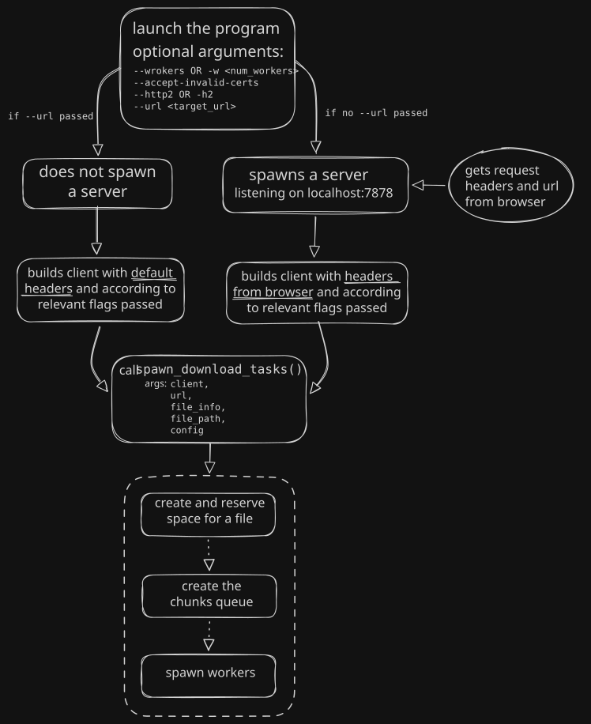

# HyperGrab

HyperGrab is an **experimental, high-performance HTTP download manager** written in Rust to explore concurrency models, network protocols, and low-level file I/O optimization.

This is a learning project where I am learning about network protocols and server behaviour, how to handle different errors and throttling by the server to get maximum performance, manage concurrent tasks along with with kernel file I/O

---

## Brief Overview of Implementation

### 1. Work-Stealing Task Queue
- Implement a **work-stealing queue** (`VecDeque<Chunk>`). Faster workers automatically grab new chunks as they finish, preventing slow connections or stragglers from delaying the overall download.
- Configurable worker count via flags (`-w`, `--workers`).

### 2. Disk I/O
- Previously `tokio::fs::File::set_len()` was used which only changes the logical size of the file creating a sparse file, causing disk allocations to occur at the time of writing chunks to disk. Replace that with `fs4::FileExt::allocate()` which uses `posix_fallocate` under the hood to reserve space on disk
- instead of writing to disk on every return from `bytes_stream().next().await`, use `BufWriter` to buffer bytes in memory before making the write syscall. This reduces the number of context switches by nearly 99% (considering 512KB buffer and 4KB result from bytes_stream)

### 3. Protocol & Network Tuning
- Use HTTP/1.1 always, instead of trying for HTTP/2, so that each worker has their own contention window, do not suffer from HoL blocking due to other workers and are truly independent as their stream is a separate connection.
- Probes metadata and byte-range support using `Range: bytes=0-0` GET requests, as servers sometimes drop HEAD requests.
- Strips conflicting browser pseudo-headers and connection headers (`:path`, `Host`, `Range`, `Connection`) to prevent TLS and HTTP protocol rejections.

### 4. Rate-Limiting & Error Recovery
- Automatically pauses and retries failed chunks up to 5 times with exponential backoff on network errors.
- Detects HTTP `429 Too Many Requests` or `503 Service Unavailable` and respects server-mandated cooldown timers before resuming requests.

### 5. Filename Resolution
- Parsing of `Content-Disposition` headers. If that is not found, a default name (download.<file_type>) is given. File type is guessed using the `mime_guess` crate

---

## High-Level Architecture Overview

<p aligne="center">
    
</p>

---

## What to implement next

- Download progress in cli
- Heuristic-based chunk sizing & worker scaling
- Pausable and resumable downloads across sessions

---

## Installation & Setup

### Prerequisites
- **Rust toolchain** (latest stable)

### Building from Source

```bash
git clone https://github.com/OmBarkare/HyperGrab.git
cd HyperGrab
cargo build --release
```

---

## How to Use

HyperGrab integrates with your browser via an extension that intercepts downloads and forwards the download URL and headers to the local Rust service.

### Step 1: Load the Browser Extension

#### For Google Chrome:
1. Open Chrome and navigate to `chrome://extensions`.
2. Enable **Developer mode** (top-right toggle).
3. Click **Load unpacked** and select the `extension/chrome` directory.

#### For Mozilla Firefox:
1. Open Firefox and navigate to `about:debugging` and go to **this firefox** tab.
2. Click **Load Temporary Add-on**.
3. Select any file inside the `extension/firefox` directory (e.g., `manifest.json`).

---

### Step 2: Start the Downloader Service

You will find the target directory in root of directory

```bash
# Default (4 workers)
`target/release/downloader-async`
# Custom worker count
`target/release/downloader-async -w <worker_cout>`

# OR use this for usage Info
`target/release/downloader-async --help`
```

### Step 3: Download
Click any download link in your browser. The extension will intercept the download and pass it to HyperGrab!
